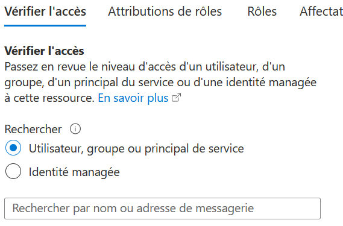

# <a name="serverless-openhack"></a>OpenHack serverless

## <a name="setting-up-permissions"></a>Configuration des autorisations

Avant de continuer, veillez à bien comprendre les autorisations nécessaires pour exécuter l’OpenHack sur votre abonnement Azure.

### <a name="initial-setup"></a>**Configuration initiale**

Pour effectuer l’installation et le déploiement visant à préparer l’OpenHack, le rôle Propriétaire doit vous être attribué sur le ou les abonnements Azure.

Pour valider cela, accédez au [portail Azure](https://portal.azure.com). Cliquez sur **Tous les services** -> **Abonnements** -> **Contrôle d’accès (IAM)** .

Entrez l’adresse e-mail dans la zone de texte **Vérifier l’accès** pour afficher les autorisations actuelles de l’utilisateur effectuant l’installation.  



### <a name="performing-the-openhack"></a>**Mise en place de l’OpenHack**

Chaque participant à l’OpenHack se voit attribuer le rôle **Propriétaire** sur un groupe de ressources propre à son équipe. Ce sujet est abordé plus loin dans ce document, dans la section Déploiement.

## <a name="common-azure-resources"></a>Ressources Azure courantes

La liste suivante répertorie les ressources Azure courantes qui sont déployées et utilisées pendant l’OpenHack.  

Assurez-vous que ces services ne sont pas bloqués par Azure Policy.  Comme il s’agit d’un OpenHack, les services que les participants peuvent utiliser ne sont pas limités à cette liste, donc les abonnements avec un catalogue de services étroitement contrôlé peuvent rencontrer des problèmes si le service qu’un participant souhaite utiliser est désactivé via une stratégie.  

| Ressource Azure           | Fournisseurs de ressources |
| ------------------------ | --------------------------------------- |  
| Azure Logic Apps         | Microsoft.Logic                         |  
| Azure Functions          | Microsoft.Web                           |  
| Azure App Service        | Microsoft.Web                           |  
| Stockage Azure            | Microsoft.Storage                       |  
| Azure Cosmos DB          | Microsoft.DocumentDb                    |  
| Event Hub                | Microsoft.EventHub                      |  
| Event Grid               | Microsoft.EventGrid                     |  
| Azure Cognitive Services | Microsoft.CognitiveServices             |  
| Réseau virtuel          | Microsoft.Network                       |  
| Azure Stream Analytics   | Microsoft.StreamAnalytics               |  
| Machine virtuelle          | Microsoft.VMWare                        |  
| Azure DevOps             | Microsoft.VSOnline                      |  
| Service Bus              | Microsoft.ServiceBus                    |  

> Remarque : L’inscription du fournisseur de ressources se trouve sur `https://portal.azure.com/_yourtenantname_.onmicrosoft.com/resource/subscriptions/_yoursubscriptionid_/resourceproviders`

## <a name="attendee-computers"></a>Ordinateurs des participants

Les participants sont tenus d’installer les logiciels sur les stations de travail sur lesquelles ils font l’OpenHack. Assurez-vous qu’ils disposent des autorisations appropriées pour effectuer l’installation des logiciels.  

## <a name="deployment-instructions"></a>Instructions de déploiement  

Pour le déploiement, vous allez exécuter un script PowerShell qui exécute un modèle ARM pour configurer le groupe de ressources approprié pour chaque équipe.  Vous allez ensuite ajouter manuellement les membres de l’équipe en tant que propriétaires au groupe de ressources. Vous pouvez exécuter le script dans **PowerShell 7+** ou **PowerShell ISE**, selon vos préférences.

### <a name="powershell"></a>PowerShell  

1. Ouvrez une fenêtre **PowerShell 7**, exécutez la commande suivante, si vous y êtes invité, cliquez sur **Oui pour tout** :

   ```PowerShell
   Set-ExecutionPolicy -Scope Process -ExecutionPolicy Bypass
   ```

2. Assurez-vous que le dernier module PowerShell Azure est installé en exécutant la commande suivante :

    ```PowerShell
    Install-Module -Name Az -AllowClobber -Scope CurrentUser
    ```

3. Si vous avez installé une mise à jour, **fermez** la fenêtre PowerShell 7 **, puis rouvrez-la**. Cette opération garantit que la version la plus récente du module **AZ** est utilisée.

4. Exécutez la commande suivante pour vous connecter au compte Azure :

    ```PowerShell
    Connect-AzAccount
    ```  

5. Si vous avez plusieurs abonnements, veillez à sélectionner l’abonnement approprié avant la prochaine étape. Utilisez `Get-AzSubscription` pour lister vos abonnements, puis utilisez la commande `Select-AzSubscription` comme indiqué ci-dessous pour définir l’abonnement que vous ciblez pour le déploiement :

    Lister les abonnements :  

    ```powershell
    Get-AzSubscription
    ```  

    Sélectionner l’abonnement à utiliser :

    ```powershell
    Select-AzSubscription -Subscription <The selected Subscription Id>
    ```  

6. Changez de répertoire en choisissant le dossier `serverless\deploy\`.  Si vous le souhaitez, examinez et/ou modifiez le script.  

    **Facultatif** : Modifiez le script pour remplacer la lecture du nombre d’équipes et/ou de la région.

    ```PowerShell
    $teamCount = Read-Host "How many teams are hacking?";
    #could be
    $teamCount = 1;
    #and 
    $region = Read-Host "What Region Resources be deployed to (i.e. centralus, southcentralus, japaneast, etc)?";
    #could be
    $region = "centralus"
    ```  

7. Exécutez le script.

    Utilisez la commande :

    ```powershell  
    .\deployAll.ps1
    ```  

    Pour exécuter le script.  

    > *Remarque : Si vous recevez une erreur disant que `azuredeploy.json` est introuvable, vérifiez que le répertoire actif de la fenêtre de la console de **PowerShell** est le dossier `serverless\deploy`.*  

   * Créez le groupe de ressources intitulé **ServerlessOpenHackRGXX-[localisation]** , où XX est le numéro à deux chiffres de l’équipe et localisation est la région que vous avez entrée ou que vous avez dans le script.  Par exemple, l’équipe 2 de **southcentralus** devrait normalement avoir le groupe de ressources `ServerlessOpenHackRG02-southcentralus`  
   * Deux comptes de stockage avec les conteneurs respectifs [sohsalesxxxxxxxxx] et [sohvmdiagxxxxxxxxx]
   * VPN [soh-vnet]
   * Interface réseau [soh-jumpbox-nic]
   * Groupe de sécurité réseau [soh-jumpbox-nsg]
   * IP publique [soh-jumpbox-pip]
   * Disque de machine virtuelle [soh-jumpbox_OsDisk_1_xxxxxxxxxxxxx]
   * Machine virtuelle [soh-jumpbox]

### <a name="manual-step"></a>Étape manuelle

Après le déploiement, ajoutez manuellement les utilisateurs appropriés avec un accès propriétaire dans le groupe de ressources approprié à leur équipe afin de leur permettre de pouvoir créer et déployer des ressources dans ce groupe de ressources.

## <a name="deployment-artifacts--validation"></a>Artifacts/validation du déploiement

Une fois le déploiement terminé, vous devriez voir les ressources suivantes dans le groupe de ressources de chaque équipe : ###

* Groupe de ressources de l’équipe XX (c.-à-d. `ServerlessOpenHackRG01-centralus`)
* Machine virtuelle - [soh-jumpbox]
* NIC - [soh-jumpbox-nic]
* NSG - [soh-jumpbox-nsg]
* IP publique - [soh-jumpbox-pip]
* Disque - [soh-jumpbox_OsDisk_1_xxxxxxxx]
* VPN - [soh-vnet]
* Ventes stockage [sohsalesxxxxxxxxxx]  
    - conteneur [reçus]  
    - conteneur [reçus-valeur-élevée]  
* Diagnostics de VM de stockage [sohvmdiagxxxxxxxxx]  
    - conteneur [bootdiagnostics-sohjumpbo-(guidish)]

## <a name="more-detail-on-the-usage-of-the-services"></a>Plus de détails sur l’utilisation des services  

Au fur et à mesure que les équipes progressent :  

* S’assurer que les équipes peuvent créer et utiliser le stockage
* S’assurer que les équipes peuvent créer des applications logiques
* S’assurer que les équipes peuvent créer des fonctions avec un service d’application de fonction standard/gratuit, puis passer à Premium
* S’assurer que les équipes peuvent créer une APIM
* S’assurer que les équipes peuvent créer des Event Hubs et intégrer des déclencheurs avec Event Grid
* S’assurer que les équipes peuvent créer une instance Service Bus et l’utiliser en guise de messagerie
* S’assurer que les équipes peuvent utiliser Stream Analytics pour filtrer les informations
* S’assurer que les équipes peuvent provisionner des services cognitifs

## <a name="services-and-application-overview"></a>Vue d’ensemble des services et des applications  

Les applications et services suivants sont utilisés dans cet OpenHack.

### <a name="logic-apps"></a>Logic Apps  

Remarques :  

* les utilisateurs en créeront au moins deux, probablement quatre ou cinq  
* réponse aux événements et traitement pour envoyer les e-mails sur un serveur Outlook/professionnel tiers  
* router les messages vers des fonctions ou autres événements de réponse  
* agréger les données pour la création de rapports, etc.  

### <a name="cosmos-db-andor-azure-tables"></a>Cosmos DB et/ou Azure Tables  

Remarques :  

* Cosmos DB sera beaucoup plus facile dans les derniers défis, c’est pourquoi nous vous recommandons d’utiliser Cosmos DB
* Ils doivent pouvoir créer des tables et répondre aux événements sur Cosmos DB

### <a name="apim"></a>APIM

Remarques :  

* les participants vont créer une passerelle de gestion des API pour regrouper les API internes et externes  
* utiliser APIM pour créer différents abonnements pour l’accès

### <a name="azure-functions"></a>Azure Functions

Remarques :

* plusieurs fonctions seront créées/déployées
* http ou Event Grid ou stockage déclenché, devront pouvoir envoyer des demandes à un point de terminaison VPN

### <a name="app-service"></a>App Service

Remarques :  

* Tirer parti d’Azure Functions dans les applications de fonctions
* commence avec un plan de base/gratuit
* auront peut-être besoin d’un plan Premium pour l’intégration réseau afin de router le trafic/verrouiller les fonctions.

### <a name="cognitive-services"></a>Cognitive Services  

Remarques :

* Cognitive Services pour analyser l’intention sur les messages/les révisions  
* utilisation de l’API Analyse de texte, intégrée aux événements et files d’attente  

### <a name="messaging-and-events"></a>Messagerie et événements

Remarques :  

* Event Grid/Event Hub pour le traitement des messages  
* Service Bus pour la mise en file d’attente des messages  

### <a name="storage"></a>Stockage  

Remarques :

* objet blob public avec conteneur pour recevoir des centaines de fichiers CSV qui seront envoyés au stockage par une application tierce
* possibilité de répondre aux événements de création de stockage via une application logique ou une fonction Azure

### <a name="iaas"></a>IaaS  

Remarques :  

* Mise en réseau  
* les équipes devront créer quelque chose qui envoie (push) à un VPN tiers

* Machine virtuelle
* Une machine virtuelle jumpbox est créée pour que les équipes voient les points de terminaison VPN à partir d’un service tiers.

### <a name="stream-analytics"></a>Stream Analytics  

Remarques :  

* Utilisé pour agréger les données pour la création de rapports  

### <a name="deploymentpipelinessource-repository"></a>Déploiement/pipelines/dépôt source  

Les équipes devront configurer des pipelines CI/CD dans Azure DevOps ou GitHub.

### <a name="development-tools"></a>Outils de développement  

Doivent utiliser un ou plusieurs des éléments suivants pour terminer le travail

* Visual Studio - les équipes devront pouvoir écrire du code dans Visual Studio
* Java / Maven  
* VS Code/Python & Node/autre développement
* postman
